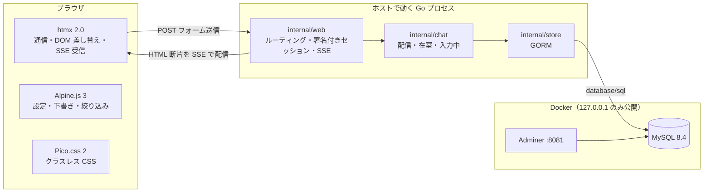
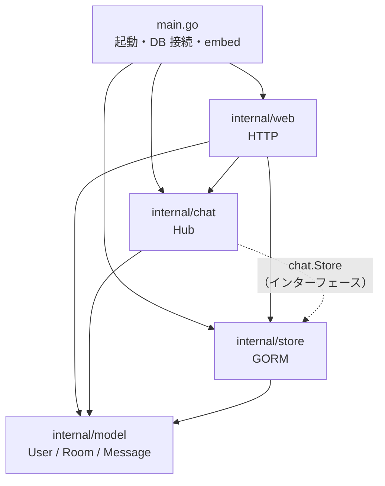
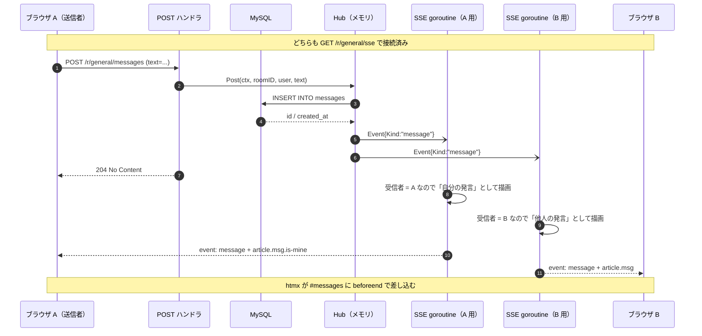
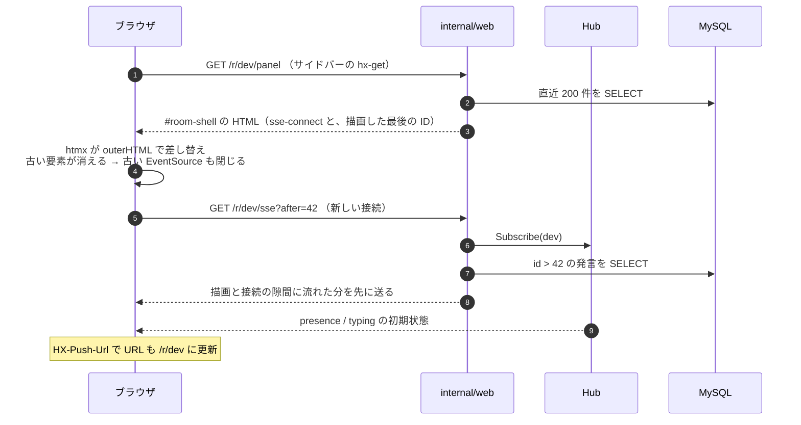
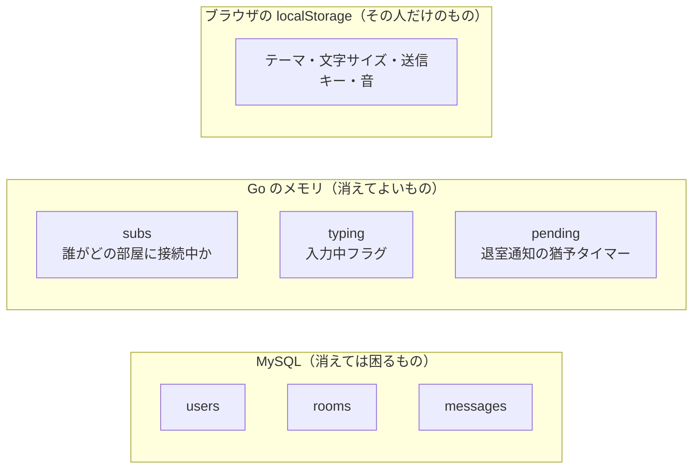

# アーキテクチャ

> 図は Mermaid で書いています。GitHub や VS Code の Markdown プレビュー（Mermaid 対応）でそのまま表示できます。

## 1. 全体構成

サーバーが **HTML を返す**のが基本方針です。JSON を返してブラウザ側で組み立て直すことはしません。



役割分担は次のとおりです。境界を混ぜないことが、このアプリを読みやすくしている一番の理由です。

| 担当 | やること | やらないこと |
|---|---|---|
| htmx | サーバーとの通信、DOM の差し替え、SSE の購読 | 画面の状態を持つこと |
| Alpine.js | サーバーに送らない状態（テーマ・文字サイズ・下書き・絞り込み） | 通信 |
| Pico.css | 見た目。クラスをほとんど書かずに済ませる | 振る舞い |
| Go | HTML の生成、配信、永続化 | JSON API を作ること |

## 2. パッケージの依存

矢印は「import する向き」です。`model` は何にも依存しないので、どこからでも安全に使えます。



`chat` は `store` を知っていますが、`store` は `chat` を知りません。この一方通行のおかげで、
「保存の都合」と「配信の都合」が混ざらずに済んでいます。

なお `chat` が実際に import しているのは `model` だけです。必要な永続化の操作は
`chat.Store` というインターフェースとして `chat` 側に置いてあり、`*store.Store` がそれを満たします
（点線）。おかげで Hub のテストは DB なしで書けます。

## 3. 発言が届くまで

このアプリで一番大事な流れです。**投稿のレスポンスは 204（空）** で、本文は SSE で戻ってきます。
自分の発言も他人の発言と同じ経路で届くので、送信側だけ特別扱いする処理がありません。



**受信者ごとにテンプレートを描画している**のがポイントです（`internal/web/templates.go` の `renderEvent`）。
「自分の発言は右寄せ」「自分の入力中は表示しない」といった判断を、
ブラウザ側の分岐ではなくサーバー側で書けます。

Hub の `broadcast` は詰まっているチャネルを読み飛ばします。
遅い 1 接続のせいで全員の配信が止まらないようにするためです。

配信は「そのとき繋がっている接続」にしか届かないので、まだ購読していない相手には届きません。
その穴の塞ぎ方は次の節に書いています。

## 4. ルーム切り替え

`#room-shell` を丸ごと差し替えます。差し替えられる HTML の中に `sse-connect` が入っているので、
**要素の入れ替え＝ SSE の張り直し**になります。切断・再接続を手で書く必要がありません。



### 描画と接続の隙間

上の図の 1〜5 の間には隙間があります。**パネルを描画してから SSE が繋がるまでの数十ミリ秒**に
誰かが発言すると、その発言は配信先が居ないまま流れてしまいます。
自分が素早く発言した場合も同じで、保存はされるのに自分の画面に出ません。

そこで、描画済みの最後の発言 ID を接続時に渡しています。

```html
sse-connect="/r/{{.Room.Slug}}/sse?after={{.LastID}}"
```

サーバーは購読を済ませてから `id > after` の分を送り、送った ID 以下はそのあとの配信ループで
読み飛ばして重複を防ぎます（`internal/web/server.go` の `handleSSE` と `store.Since`）。
ルーム切り替えだけでなく、最初のページ読み込みにも同じ隙間があるので、両方まとめて塞がります。

## 5. 状態はどこにあるか

「データ」と「接続の状態」を分けて置いているのが、この設計の要点です。



| 状態 | 置き場所 | 再起動すると |
|---|---|---|
| ユーザー・ルーム・発言 | MySQL | 残る |
| 在室リスト、入力中 | Go のメモリ（`internal/chat/hub.go`） | 消える（＝正しい。接続が切れているので） |
| テーマ・文字サイズなどの設定 | ブラウザの localStorage | 残る（その人のブラウザにだけ） |
| ログイン状態 | 署名付き Cookie + `users` | `HAPCHAT_SECRET` を固定していれば残る |

在室状況を DB に入れないのは、それが**データではなく接続の状態**だからです。
プロセスが落ちればその接続も消えているので、DB に残っていたらむしろ嘘になります。

## 6. エンドポイント一覧

| メソッド | パス | 返すもの | 呼ぶ人 |
|---|---|---|---|
| GET | `/` | 入室画面（参加済みならリダイレクト） | ブラウザ |
| POST | `/join` | `HX-Redirect` | 入室フォーム |
| POST | `/leave` | `HX-Redirect` | ユーザーメニュー |
| POST | `/profile` | `HX-Redirect` | プロフィール modal |
| GET | `/r/{room}` | ページ全体 | ブラウザ |
| GET | `/r/{room}/panel` | `#room-shell` の断片 | htmx（ルーム切り替え） |
| GET | `/r/{room}/sse?after={id}` | イベントストリーム（`after` 以降の取りこぼしも送る） | htmx SSE 拡張 |
| POST | `/r/{room}/messages` | 204（本文は SSE で届く） | 入力フォーム |
| POST | `/r/{room}/typing` | 204 | 入力欄（throttle 1.5s） |

SSE で流すイベントは 3 種類です。

| イベント名 | 差し込み先 | 差し込み方 |
|---|---|---|
| `message` | `#messages` | `beforeend`（末尾に追加） |
| `presence` | `#presence` | `innerHTML`（丸ごと差し替え） |
| `typing` | `#typing` | `innerHTML`（空文字なら消える） |

## 7. 読む順番のおすすめ

1. `templates/partials/room-shell.html` — `sse-connect` と `sse-swap` がどこにあるか
2. `internal/web/server.go` の `handleSSE` — 1 接続 = 1 goroutine の形
3. `internal/chat/hub.go` の `broadcast` / `Subscribe` — 配信と在室管理
4. `internal/web/templates.go` の `renderEvent` — 受信者ごとの描画
5. `static/js/app.js` — htmx と Alpine のつなぎ目
