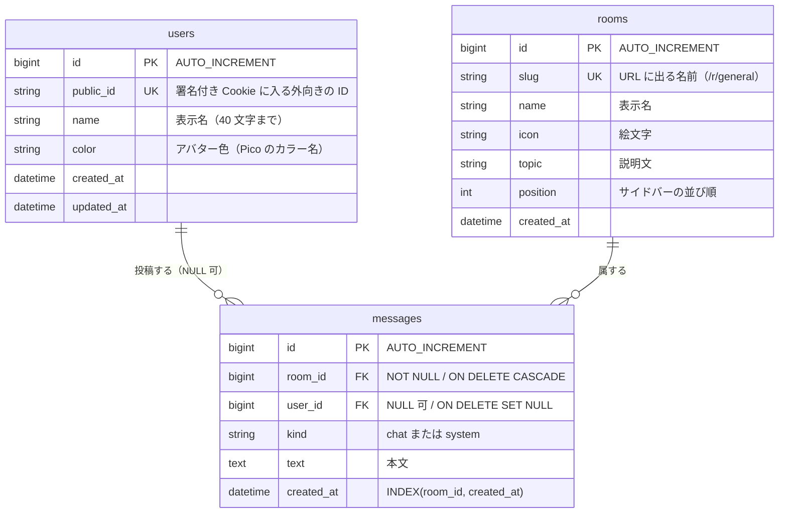

# データベース設計

MySQL 8.4 に GORM で読み書きします。テーブルは 3 つだけです。

## 1. ER 図



## 2. なぜこの形なのか

### `users.public_id` — 連番の主キーを外に出さない

Cookie に `id = 3` と入れると、他人の ID が簡単に推測できてしまいます。
そこで 16 バイトのランダム値 `public_id` を別に持ち、Cookie にはこちらを入れています。
さらに HMAC-SHA256 の署名を添えるので、書き換えても弾かれます。

```
Cookie: hap_session=<public_id>.<HMAC-SHA256 署名>
```

名前も色も DB 側が正なので、Cookie を改造しても表示名は変えられません。

### `messages.user_id` が NULL 可 — 入退室のお知らせ

「◯◯ さんが参加しました」は誰の発言でもないので、`kind = 'system'` かつ `user_id IS NULL` で保存します。
また `ON DELETE SET NULL` にしてあるので、ユーザーを削除しても発言は残ります
（発言だけ消えて会話が虫食いになるのを避けるため）。

一方 `room_id` は `ON DELETE CASCADE` です。部屋を消したらその中の発言も一緒に消えるべきなので。

### `rooms.slug` — URL に出る名前を別に持つ

`/r/general` の `general` が `slug` です。主キーを URL に出すと、
あとから部屋を作り直したときに URL が変わってしまいます。

### `INDEX(room_id, created_at)` — 一番よく打つクエリに合わせる

画面を開くたびに「ある部屋の、新しい順に 200 件」を引きます。
`room_id` で絞ってから並べるので、この 2 列を**この順番で**張るのが効きます。
逆順（`created_at, room_id`）だと `room_id` での絞り込みに使えません。

### `utf8mb4` — 絵文字は 3 バイトに収まらない

MySQL の `utf8` は 3 バイトまでしか扱えず、🎉 のような 4 バイト文字が保存できません。
DSN の `charset=utf8mb4` とサーバー側の `--character-set-server=utf8mb4` の**両方**が必要です。

## 3. GORM の書き方と、実際に流れる SQL

`-sql` フラグを付けて起動すると、下の SQL がログに出ます。手元で確かめながら読んでください。

```bash
go run . -dev -sql
```

### 部屋を開く（`store.Recent`）

```go
s.db.WithContext(ctx).
    Preload("User").                  // 投稿者をまとめて引く
    Where("room_id = ?", roomID).
    Order("id desc").
    Limit(limit).
    Find(&msgs)
```

発行される SQL は 2 本です。

```sql
SELECT * FROM `messages` WHERE room_id = 1 ORDER BY id desc LIMIT 200;
SELECT * FROM `users`    WHERE `users`.`id` IN (3,2,1);
```

**200 件それぞれに `SELECT * FROM users WHERE id = ?` が飛ぶわけではありません。**
GORM の `Preload` は取得済みの行から ID を集め、`IN` で 1 回にまとめます（N+1 の回避）。

なお最初は `Preload(clause.Associations)`（全部の関連）と書いていましたが、
それだと `rooms` への SELECT が 1 本増えます。部屋の情報は呼び出し側が既に持っているので、
`Preload("User")` と明示するほうが素直です。

### 発言を保存する（`store.Add`）

```go
s.db.WithContext(ctx).Omit(clause.Associations).Create(m)
```

```sql
INSERT INTO `messages` (`room_id`,`user_id`,`kind`,`text`,`created_at`)
VALUES (1, 3, 'chat', 'SQL の確認用', '2026-08-29 00:57:02.483');
```

`Omit(clause.Associations)` が要るのは、`Message` が `Room` と `User` のフィールドを
持っているからです。付けないと GORM が関連先まで INSERT / UPDATE しにいきます。
`Create` のあと、`m.ID` と `m.CreatedAt` には DB が決めた値が入ります。

### ログインしているユーザーを引く（`store.UserByPublicID`）

```go
s.db.WithContext(ctx).Where("public_id = ?", publicID).First(&u)
```

```sql
SELECT * FROM `users` WHERE public_id = 'b1b8…' ORDER BY `users`.`id` LIMIT 1;
```

`First` は「1 件だけ」を保証するため主キー順の `LIMIT 1` を自動で付けます。
リクエストごとに 1 回走るので、`public_id` の UNIQUE インデックスがそのまま効きます。

### プロフィールを更新する（`store.UpdateProfile`）

```go
s.db.Model(&model.User{}).Where("id = ?", id).
    Updates(map[string]any{"name": name, "color": color})
```

構造体ではなく `map` を渡しているのは、**ゼロ値を無視されないため**です。
GORM は構造体で `Updates` すると空文字や 0 の列を「指定なし」とみなして飛ばします。
`map` なら書いた列は必ず更新されます。ここは GORM でよく踏む落とし穴です。

## 4. マイグレーション

起動時に `AutoMigrate` が走り、テーブルが無ければ作られます。

```go
db.AutoMigrate(&model.User{}, &model.Room{}, &model.Message{})
```

初期ルームは `slug` が無いときだけ作られます（`FirstOrCreate`）。
DB 側でトピックを書き換えても、起動のたびに戻されることはありません。

> **注意**: `AutoMigrate` は列の追加はしますが、**削除や型の縮小はしません**。
> 学習用にはこれで十分ですが、実運用では golang-migrate や Atlas のような
> マイグレーションツールに切り替えるのが定石です。

## 5. 中身を見る

Adminer（http://localhost:8081）から見るのが手軽です。

| 項目 | 値 |
|---|---|
| System | MySQL |
| Server | `db` |
| Username | `hap` |
| Password | `hap` |
| Database | `hapchat` |

CLI から見る場合は、日本語のために `--default-character-set=utf8mb4` を付けてください。

```bash
docker exec -it hapchat-mysql mysql --default-character-set=utf8mb4 -uhap -phap hapchat
```

会話をまとめて眺めるクエリ:

```sql
SELECT r.slug AS room,
       COALESCE(u.name, '(system)') AS author,
       m.kind, m.text, m.created_at
FROM messages m
JOIN rooms r ON r.id = m.room_id
LEFT JOIN users u ON u.id = m.user_id
ORDER BY m.id;
```

`LEFT JOIN` なのは、システムメッセージの `user_id` が NULL だからです。
`JOIN` にすると入退室のお知らせが消えます。

全部消してやり直すには `docker compose down -v` です（ボリュームごと削除）。

## 6. ここから先の練習問題

| やってみること | 触る場所 |
|---|---|
| 発言に「編集済み」を足す | `messages` に `updated_at` を追加、`AutoMigrate` に任せる |
| 部屋をブラウザから作れるようにする | `rooms` への INSERT と、`Hub` のルーム一覧の作り直し |
| 発言の削除（論理削除） | `gorm.DeletedAt` を足すと `WHERE deleted_at IS NULL` が自動で付く |
| 未読件数 | 「どこまで読んだか」を持つ表が要る。`user_id + room_id + last_read_message_id` |
| 当時の表示名を残す | `messages` に `author_name` をコピーして保存する（非正規化） |
